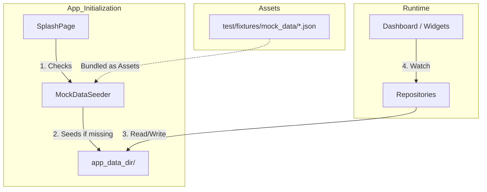
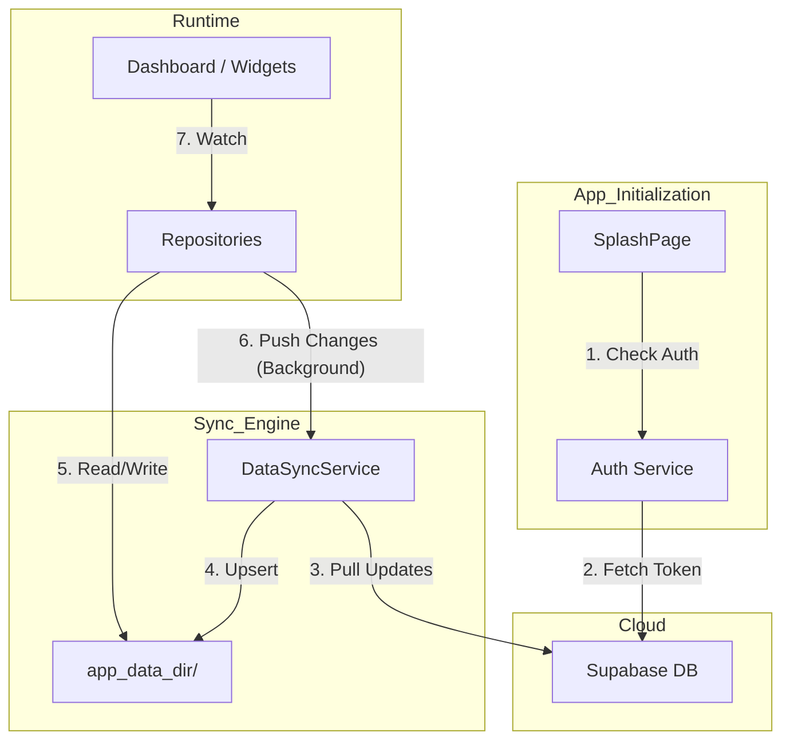
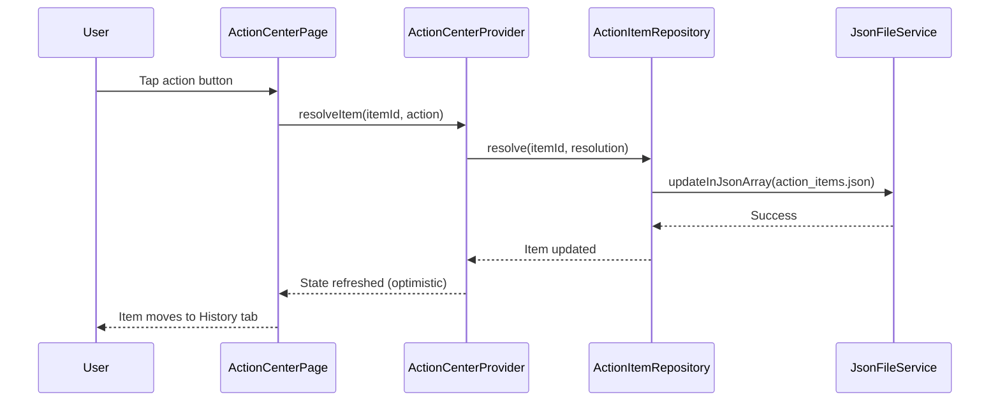
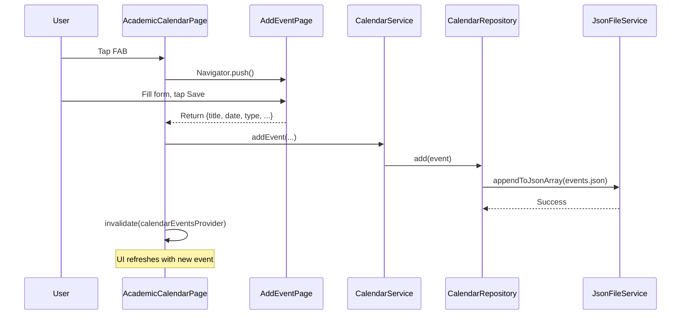
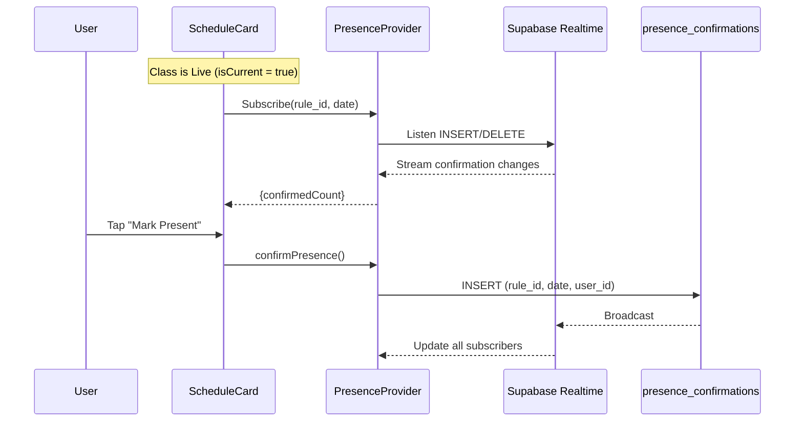

# Data Flow Documentation

This document describes how data flows between schema files and UI components.

## Development vs Production Data Flow

This section details how data handling differs between the current development environment (using mock data) and the future production environment.

### 1. Development Flow (Current)

In development, we use local mock data fixtures to simulate checking and syncing data. This allows for rapid UI testing without a live backend.



**Key Characteristics:**
- **Source of Truth:** Static JSON files in `test/fixtures/mock_data/`.
- **Initialization:** `SplashPage` triggers `MockDataSeeder` on startup.
- **Persistence:** Data is written to the device's application documents directory.
- **Reset:** Uninstalling the app or clearing data resets state to the fixtures.

### 2. Production Flow (Future)

In production, the `MockDataSeeder` is removed. Data is sourced from the Supabase cloud backend and synced to local storage for offline access.



**Key Characteristics:**
- **Source of Truth:** Supabase Database (Cloud).
- **Initialization:** `SplashPage` checks authentication; `DataSyncService` runs in background.
- **Persistence:** Local JSON files serve as an "Offline Cache".
- **Synchronization:** 
    - **Pull:** On startup/refresh, fetch changes since `last_synced_at`.
    - **Push:** User actions (attendance, edits) write locally first, then push to cloud (Optimistic UI).

### Import Feature
User can restore data from `adsum_backup.json`.

**Logic:**
1.  **Read JSON:** Parse backup file.
2.  **Merge Strategy:**
    *   **User/Settings:** Overwrite local `user.json` (except device-specifics).
    *   **Enrollments:** Upsert based on `enrollment_id`.
    *   **Attendance:** Upsert based on `log_id`.
    *   **Appends:** Add missing events/overrides.
    *   **Appends:** Add missing events/overrides.

---

## Onboarding & Identity

**Sources:**
| Table | Purpose |
|-------|---------|
| `universities` | Master list of universities (Name + ID) |
| `hostels` | Filtered list of hostels for selected university |

**Onboarding Data Logic:**
1.  **Fetch Universities:** `SELECT * FROM universities WHERE is_active = true`
2.  **User Selection:** User selects `university_id`.
3.  **Fetch Hostels:** `SELECT * FROM hostels WHERE university_id = ?`
4.  **User Input:**
    *   **Hostel:** Optional (nullable `home_hostel_id`).
    *   **Section:** Defaults to "A" if empty (`default_section`).
    *   **Name:** Optional (defaults to "Student").
5.  **Creation:** Instantiate `UserProfile` with defaults.

**Write Actions:**
| Action | Target | Operation |
|--------|--------|-----------|
| **Complete Setup** | `user.json` | Write initial `UserProfile` object |
| **Sync Profile** | `users` Table | *Future: Upsert to Cloud* |

### Step 1: Course Entry (Wizard)

**Context:** The first step after University selection where users choose how to add courses.

**Sources:**
| File | Purpose |
|------|---------|
| `user.json` | Used for personalized header ("Hi [Name]") |

**UI Element Mapping:**
| UI Element | Source |
|------------|--------|
| **Header** | `UserProfile.fullName` (first name extracted) |
| **Scan Card** | Static (Disabled feature) |
| **Manual Entry** | Navigation Action |

**Write Actions:**
*None.* Read-only view.

### Step 2: Course Selection (Wizard)
*Also known as Manage Courses Page.*

**Context:** User selects courses via search or creates custom ones. All interactions happen inline on `CoursesPage`.

**Sources:**
| File | Purpose |
|------|---------|
| `enrollments.json` | List of currently enrolled courses |
| `custom_schedules.json` | Schedule details for custom courses |
| `schedule_bindings.json` | GPS/WiFi bindings for course slots |
| `SharedDataRepository` | University course catalog (Mock) |

**UI Element Mapping:**
| UI Element | Source |
|------------|--------|
| **Course List** | `enrollments.json` (split Global/Custom) |
| **Search Dropdown** | `SharedDataRepository` (Mock Catalog) |
| **Enrollment Modal** | Collects Section, Target %, Color before saving |
| **Inline Edit Form (Global)** | Edit Section, Target %, Color, GPS/WiFi bindings (Name/Code/Instructor read-only) |
| **Inline Edit Form (Custom)** | Full edit of all fields including slots |

**Write Actions:**
| Action | Target | Operation |
|--------|--------|-----------|
| **Enroll (Catalog)** | `enrollments.json` | Add new enrollment with section, target %, color |
| **Create Custom** | `enrollments.json` | Add new custom enrollment |
| **Save Schedule** | `custom_schedules.json` | Add slots for custom course |
| **Save Bindings** | `schedule_bindings.json` | Add GPS/WiFi bindings (works for BOTH Global & Custom) |
| **Update Course** | `enrollments.json` | Modify existing enrollment |
| **Delete** | `enrollments.json` | Remove enrollment |

> [!NOTE]
> **Start Date Logic:**
> - **Global Courses**: Start Date = `University.semester_start` (Read-only, from university calendar).
> - **Custom Courses**: Start Date = `Enrollment.start_date` (Editable, user-defined).

---

## Subject Detail Page

### Stats Tab

| UI Element | Source File | Query/Derivation |
|------------|-------------|------------------|
| Attendance % | `enrollments.json` | `stats.attended / stats.total_classes × 100` |
| Safe Bunks | `enrollments.json` | `stats.safe_bunks` |
| Total Classes | `enrollments.json` | `stats.total_classes` |
| Attended | `enrollments.json` | `stats.attended` |
| 7-Day History | `attendance.json` + `academic_calendar.json` | Filter last 7 days. Merge with holidays/cancellations. |

#### History Log (View Calendar)

**Sources:**
- `attendance.json` (Base attendance status)
- `academic_calendar.json` (Holidays)
- `schedule_modifications` table (Cancellations/Reschedules)

**Layered Retrieval Logic:**
1. **Initialize Grid:** Generate dates for the month.
2. **Apply Holidays:** Query `academic_calendar` for holidays on these dates. Mark as `HOLIDAY`.
3. **Apply Patches:** Query `schedule_modifications` for `CANCELLED` status. Mark as `CANCELLED`.
4. **Apply Attendance:** For remaining "Class" days, query `attendance.json` for status.


**Verify Flow (for PENDING):**
- User taps "Verify Attendance" → Selects "I was Present" / "I was Absent"
- Updates `attendance.json`: `status` + `verification_state` = `MANUAL_OVERRIDE`

**Edit Flow (for PRESENT/ABSENT):**
- User taps "Edit Status" → Toggles status
- Updates `attendance.json`: `status` changed, `verification_state` = `MANUAL_OVERRIDE`

### Syllabus Tab

**Sources:**
| File/Table | Purpose |
|------------|---------|
| `syllabus_units` | Catalog course unit structure (sync'd) |
| `syllabus_topics` | Catalog course topic definitions (sync'd) |
| `custom_syllabus.json` | Custom course structure (user-defined) |
| `syllabus_progress.json` | Completed topic IDs (both types) |

**Data Retrieval Logic:**
```
1. Check: Is enrollment.course.is_custom = true?
   ├─ YES (Custom) → Load structure from custom_syllabus.json WHERE course_code
   └─ NO (Catalog) → Load structure from syllabus_units + syllabus_topics WHERE course_code

2. Load progress: syllabus_progress.json[course_code] → Array of topic_ids

3. Merge: For each topic in structure:
   └─ topic.done = (topic_id IN progress_array)
```

**UI Element Mapping:**
| UI Element | Source | Rendering |
|------------|--------|-----------|
| Progress Card | Merged data | `completed / total × 100%` |
| Modules Accordion | `units[]` | Expandable list grouped by unit_order |
| Topic Checkbox | `topic.done` | Checked if topic_id in progress |
| Edit/Import Button | `is_custom` | Shown only for custom courses |

**Write Actions:**
| Action | Target File | Operation |
|--------|-------------|-----------|
| Toggle topic | `syllabus_progress.json` | Add/remove `topic_id` from array |
| Save syllabus (custom) | `custom_syllabus.json` | Overwrite units/topics structure |

### Work Tab

**Sources:**
| File/Table | Purpose |
|------------|---------|
| `course_work` | Assignment/quiz/exam definitions |
| `work_states.json` | User's completion status + grade |
| `work_comments.json` | Local cache of discussion threads |

**Data Retrieval Logic:**
```
1. Load work: SELECT * FROM course_work WHERE course_code = ?
2. Load states: work_states.json[work_id]
3. Load comments: work_comments.json[work_id] (or fetch from `work_comments` table)
4. Merge: For each work item, attach status from states (PENDING/SUBMITTED/GRADED) and comments
5. Filter: Optionally hide items where is_hidden_from_calendar = true
```

**UI Element Mapping:**
| UI Element | Source | Rendering |
|------------|--------|-----------|
| Task List | `course_work[]` | Filter by `course_code`, sort by `due_at` |
| Assignment Card | `course_work` (type=ASSIGNMENT) | **Title**, Due (`due_at`), Status |
| Quiz Card | `course_work` (type=QUIZ) | **Title**, Window (`start_at`-`due_at`), Duration (`duration_minutes`) |
| Exam Card | `course_work` (work_type=EXAM) | **Title**, Date (`start_at`), Venue (`venue`) |

**Work Detail Page Mapping:**
| UI Element | Schema Table | Schema Field |
|------------|--------------|--------------|
| Course Tag | `course_work` | `course_code` |
| Type Badge | `course_work` | `work_type` |
| Title | `course_work` | `title` |
| Due/Date | `course_work` | `due_at` / `start_at` |
| Duration | `course_work` | `duration_minutes` |
| Venue | `course_work` | `venue` |
| Description | `course_work` | `description` |
| Discussion | `work_comments` | `text`, `user_id`, `created_at` |

**Write Actions:**
| Action | Target | Operation |
|--------|--------|-----------|
| Mark Done | `work_states.json` | Set `status = "SUBMITTED"` |
| Hide | `work_states.json` | Set `is_hidden_from_calendar = true` |
| Post Comment | `work_comments.json` | Append locally + Sync to `work_comments` table |

### Info Tab
*Read-only overview of course details and settings.*

**Sources:**
| File | Purpose |
|------|---------|
| `enrollments.json` | Course metadata (`custom_course` or `course_code`), Section, Color |
| `courses` table | Catalog course metadata (name, instructor) |
| `schedule_bindings` | Counts of bound slots vs default |

**Data Retrieval Logic:**
```
1. Fetch Slots:
   ├─ Catalog: SELECT * FROM global_schedules WHERE course_code
   └─ Custom: Read custom_schedules.json WHERE enrollment_id

2. Fetch Bindings: Read schedule_bindings.json WHERE rule_id IN (slots)

3. Merge for Display:
   For each slot:
   ├─ If binding exists → Status = "Bound: " + binding.location_name
   └─ Else → Status = "Default: " + slot.location_name
```

**UI Element Mapping:**
| UI Element | Source |
|------------|--------|
| **Course Details** | Name, Code, Instructor (from `enrollments` or `courses`) |
| **Catalog Tag** | Shown if `custom_course == null` |
| **Schedule Summary** | List slots; show derived "Bound" / "Default" status (no edit) |
| **Enrollment** | Read-only display of `section` and `target_attendance` |
| **Settings** | Read-only display of `color_theme` |

**Write Actions:**
*None.* All edits must be done via `Manage Courses Page`.

### Manage Courses Page
*Centralized hub for all course configuration.*

**Two Categories:**

| Section | Custom Course | University Catalog |
|---------|--------------|-------------------|
| **Course Details** | All editable (Name, Code, Instructor, Expected) | Read-only + "University Catalog" tag |
| **Schedule Structure** | Add/Remove/Edit Slots | Read-only (from `global_schedules`) |
| **Slot Bindings** | Per-slot GPS/WiFi binding (via `schedule_bindings`) | Per-slot GPS/WiFi binding (overrides `global_schedules` defaults) |
| **My Enrollment** | Section, Target Attendance | Section, Target Attendance |
| **Settings** | Color Theme | Color Theme |
| **Actions** | "Delete Course" | "Unenroll from Course" |

**Sources:**
| File | Purpose |
|------|---------|
| `enrollments.json` | User's enrollment data (including `custom_course` definition) |
| `courses` table | Global course metadata (read-only for Catalog) |
| `global_schedules` | Default schedule for Catalog courses |
| `custom_schedules.json` | Schedule for Custom courses |
| `schedule_bindings.json` | User's per-slot location override (both types) |

**Write Actions:**
| Action | Target | Condition | Operation Logic |
|--------|--------|-----------|-----------------|
| Update Custom Course | `enrollments.custom_course.*` | Custom only | **OVERWRITE** entire object |
| Update Schedule | `custom_schedules.json` | Custom only | **add/remove** slots |
| Update Section | `enrollments.section` | Both | **OVERWRITE** field |
| Update Target | `enrollments.target_attendance` | Both | **OVERWRITE** field |
| Update Theme | `enrollments.color_theme` | Both | **OVERWRITE** field |
| Update Slot Binding | `schedule_bindings.json` | Both | **UPSERT** (create or update binding) |
| Delete Course | `enrollments` entry | Custom only | **DELETE** row |
| Unenroll | `enrollments` entry | Catalog only | **DELETE** row |

---

---

## Unified Assignments Page

**Context:** Centralized list of all assignments, quizzes, and exams across all enrolled courses.

**Sources:**
| File/Table | Purpose |
|------------|---------|
| `course_work` | Master list of all tasks |
| `work_states.json` | Completion status and hidden flags |
| `enrollments.json` | Course colors and names (for context) |

**Data Retrieval Logic:**
```
1. Fetch ALL work: SELECT * FROM course_work (No course filter)
2. Join States: Attach status from work_states.json
3. Partition:
   ├─ Pending: status != SUBMITTED && status != GRADED && !is_hidden_from_calendar
   └─ Completed: status == SUBMITTED || status == GRADED
4. Sort:
   ├─ Pending: Ascending by due_at (Urgent first)
   └─ Completed: Descending by due_at (Recent first)
```

**UI Element Mapping:**
| UI Element | Source | Rendering |
|------------|--------|-----------|
| Course Color Strip | `enrollments.json` | Left border color matching course theme |
| Urgency Badge | `due_at` | "Flame" icon if due < 24h |
| Completed Check | `work_states.status` | Green circle check in Completed tab |

**Navigation Flow:**
*   **Tap Task** -> Navigate to `/academics/detail` (Work Detail Page).

---

## Academics Page

**Context:** The "Shared Brain" of the class. Provides an aggregated view of all courses, their attendance status, and quick access to details.

**Source:** `enrollments.json`

| UI Element | Query/Logic |
|------------|-------------|
| **Course Feed** | List all `enrollments.json` entries. |
| **Smart Summary Card** | Calculate `risk_count`: Count courses where `stats.attended / stats.total_classes < target_attendance`. |
| **Attendance %** | `stats.attended / stats.total_classes * 100` |
| **Safe Bunks** | Show `stats.safe_bunks`. |
| **Status Bar** | Visual progress bar of attendance %. |

**Navigation Flow:**
*   **Tap Course Card** -> Navigate to `/subject-detail`.
    *   **Payload:** Pass `enrollment.enrollmentId` (and derived `course_code` for catalog courses).
    *   **Purpose:** The Subject Detail page uses this ID to fetch specific `attendance.json` logs and `course_work` items.

**Write Actions:**
*   **Add Course (FAB)** -> Navigate to `/manage-courses` (Standalone Mode) to create custom or enroll in global courses.

---

## Action Center

**Context:** Unified inbox for all pending actions and decisions requiring user attention.

**Sources:**
| File | Purpose |
|------|---------|
| `action_items.json` | All action items (pending + resolved) |
| `attendance.json` | Updated by VERIFY actions |
| `work_states.json` | Updated by ASSIGNMENT_DUE actions |

### Data Retrieval Logic

```
1. Fetch all items: ActionItemRepository.getAll() → action_items.json
2. Partition in UI:
   ├─ Pending: items.where(i => i.status == PENDING)
   └─ History: items.where(i => i.status == RESOLVED)
3. Sort:
   ├─ Pending: By createdAt (oldest first for urgency)
   └─ History: By createdAt descending (newest first)
```

### UI Element Mapping

| Tab | Query | Displayed Fields |
|-----|-------|------------------|
| **Pending** | `status = "PENDING"` | Type-specific card content |
| **History** | `status = "RESOLVED"` | Title, body, resolution status, date |

### Type-Specific Card Rendering

| Type | Display Fields | Payload Fields Used |
|------|----------------|---------------------|
| **CONFLICT** | Split comparison view, "Schedule Clash" title | `sourceA`, `sourceB`, `conflict_category` |
| **VERIFY** | Message, Course name | `message`, `course` |
| **SCHEDULE_CHANGE** | Message from CR | `message`, `course` |
| **ASSIGNMENT_DUE** | Work title, Course, Due countdown | `work`, `course`, `due_text` |
| **ATTENDANCE_RISK** | Course, Recovery message, Current % | `course`, `message`, `current_per` |

### Write Actions

| Action | Trigger | Target File | Operation |
|--------|---------|-------------|-----------|
| **Accept Update** | CONFLICT | `action_items.json` | Set `status = RESOLVED`, `resolution = ACCEPT_UPDATE` |
| **Keep Mine** | CONFLICT | `action_items.json` | Set `status = RESOLVED`, `resolution = KEEP_MINE` |
| **Yes, Present** | VERIFY | `action_items.json`, `attendance.json` | Resolve item + Update attendance log |
| **No, Absent** | VERIFY | `action_items.json`, `attendance.json` | Resolve item + Mark absent in attendance |
| **Mark Done** | ASSIGNMENT_DUE | `action_items.json`, `work_states.json` | Resolve item + Set work status to SUBMITTED |
| **Snooze** | ASSIGNMENT_DUE | `action_items.json` | Set `status = RESOLVED`, `resolution = SNOOZE` |
| **Acknowledge** | SCHEDULE_CHANGE | `action_items.json` | Set `status = RESOLVED`, `resolution = ACKNOWLEDGED` |
| **Details** | ATTENDANCE_RISK | `action_items.json` | Resolve item, navigate to Subject Detail |

### Resolution Flow



---

## Dashboard

The main dashboard displays a date-sensitive timeline with alerts, scheduled events, and mess menus.

### Date Strip
*Horizontal 7-day date picker at the top of the dashboard.*

**Sources:** `DateTime.now()`, `events.json`

| Element | Source | Description |
|---------|--------|-------------|
| Day Capsules (7) | Computed | 3 past, today, 3 future |
| Today Capsule | Computed | Shows "Today" label + primary color ring |
| Selected Day | UI State | Dark fill with shadow highlight |
| Past Days | Computed | Dimmed grey styling |
| Future Days | Computed | White background |
| Event Dot | `events.json` | Yellow dot if any event on that date |

**Tap Action:** Selects day → Refreshes timeline and alerts below.

---

### Priority Alert Carousel
*Top section showing critical, time-sensitive items. Hidden if empty or on past dates.*

**Sources:** `action_items.json`, `events.json`, `enrollments.json`

| Alert Type | Source | Trigger Condition |
|------------|--------|-------------------|
| Assignment Due | `action_items.json` | `type = ASSIGNMENT_DUE` AND due within 24-48h |
| Urgent Broadcast | `action_items.json` | `type = SCHEDULE_CHANGE` (from CR) |
| Attendance Risk | `action_items.json` | `type = ATTENDANCE_RISK` |
| Pending Conflict | `action_items.json` | `type = CONFLICT` AND `status = PENDING` |
| Upcoming Exam | `events.json` | `type = EXAM` AND starts within 48h |

#### Visibility Rules

| Selected Date | Carousel Behavior |
|---------------|-------------------|
| **Today** | ✅ Show all relevant alerts |
| **Past Date** | ❌ Hide carousel entirely |
| **Future Date** | ⚠️ Show only date-specific alerts (exam/assignment on that day) |
| **No Active Alerts** | ❌ Hide carousel (don't show empty) |

#### Alert Card UI

| Alert Type | Display Fields | Tap Action | Color |
|------------|----------------|------------|-------|
| Assignment | Title, Due Time, "Due Soon" | Assignment Detail | 🔵 Blue |
| Attendance Risk | Course, Current %, Target %, "Risk" | Subject Detail | 🟠 Orange |
| Exam | Title, Starts In, "Super Event" | Exam Command Center | 🔴 Red |
| Conflict | Source A vs Source B, "Resolve" | Conflict Modal | 🟡 Yellow |

---

### Timeline
*Chronological list of events for the selected date.*

**Sources:** 
- `enrollments.json` + `global_schedules` / `custom_schedules.json` → Course slots
- `schedule_modifications` table → Cancellations, reschedules, extra classes
- `events.json` → Personal events, exams, holidays
- `course_work` table + `work_states.json` → Assignments (due date markers)
- `menu_cache.json` → Mess menus

> [!IMPORTANT]
> **Assignments come from `course_work` (Supabase), NOT `events.json`.**
> They appear on the calendar/timeline via derivation from `course_work.due_at`.

#### Card Types

| Card Type | Source | Display Fields | Tap Action |
|-----------|--------|----------------|------------|
| Course (Normal) | `global_schedules` / `custom_schedules` | Title, Time, Location, Prof | Subject Detail |
| Course (Cancelled) | `schedule_modifications` | Title, *Original Time*, "Cancelled" Badge | Subject Detail |
| Course (Rescheduled) | `schedule_modifications` | Title, *New Time*, "Rescheduled" Badge | Subject Detail |
| Course (Extra) | `schedule_modifications` | Title, Time, Location, "Extra Class" Badge | Subject Detail |
| Course (Room Swap) | `schedule_modifications` | Title, Time, *New Location*, "Room Changed" Badge | Subject Detail |
| Assignment | `course_work` (derived) | Title, Due Time, Course | Work Detail |
| Mess | `menu_cache.json` | Meal Type, Time, Hostel, Menu Items | Mess Menu |
| Exam/Quiz | `course_work` (is_super_event=true) | Title, Time, Venue, Duration, "Blocking" | Subject Detail |
| Personal | `events.json` (type=PERSONAL) | Title, Time, Note | Edit Event |
| Holiday | `events.json` (type=HOLIDAY) | Title, "No Classes" | - |

#### Source Provenance Indicators
*Visual indication of where each schedule item originates.*

| Source | Color | Icon | Example |
|--------|-------|------|---------|
| Admin (Official) | Grey/Neutral | Shield | Base university schedule |
| CR (Update) | 🔵 Blue | Pencil | Class moved by CR |
| User (Personal) | 🟣 Purple | Person | Gym session, personal event |

**Derivation Logic:**
```
For each timeline slot:
├─ From global_schedules → Source = ADMIN (Grey)
├─ Has schedule_modifications entry → Source = CR (Blue)
└─ From events.json OR custom_schedules → Source = USER (Purple)
```

---

### Conflict Detection & Display

**Sources:** Layer merge algorithm + `action_items.json`

#### Layer Priority (Schedule Merge)

```
L0: Academic Calendar (Holiday, Day Swap, Exam Block)  ← HIGHEST
L1: Global Schedules (Base timetable)
L2: CR Modifications (Cancel, Reschedule, Extra, Room Swap)
L3: User Events (Personal, Custom courses)             ← LOWEST
```

#### Conflict Resolution Data Flow

| Conflict Type | Detection | Output |
|---------------|-----------|--------|
| L0 vs L1 | Holiday/Exam on class day | Auto-hide L1 |
| L2 vs L1 | `schedule_modifications` entry exists | Apply patch to L1 |
| L3 vs L1/L2 | Time overlap | Generate `CONFLICT` action_item |
| L3 vs L3 | Time overlap | Generate `CONFLICT` action_item |

**Writes:**
- Unresolved conflicts → `action_items.json` with `type = CONFLICT`
- Resolution → Updates `action_items.json` status + may update `attendance.json`

> [!NOTE]
> See `FEATURES.md` → "Conflict Card Display" for UI specification.

## Global Search

**Sources:** Multiple

| Category | Source File | Searchable Fields |
|----------|-------------|-------------------|
| Courses | `enrollments.json` → `course` | `name`, `code` |
| Professors | `enrollments.json` → `course.instructor` | `instructor` |
| Assignments | `action_items.json` | `title` (where type = ASSIGNMENT_DUE) |
| Events | `events.json` | `title` |

---

## Mess Menu

**Source:** `menu_cache.json`

| UI Element | Query |
|------------|-------|
| Menu Cards | Filter by `hostel_id` + `date` |
| Meal Tabs | Group by `meal_type` (B/L/S/D) |

---

## Academic Calendar

**Route:** `/calendar`

**Context:** Full-month calendar view with event markers and agenda list for managing academic and personal events.

### Sources

| File | Purpose |
|------|---------|
| `events.json` | All calendar events (user-created + imported) |
| `course_work` (Supabase) | Assignments/exams with `due_at` dates |

### Data Retrieval Logic

```
1. Fetch events: CalendarRepository.getAll() → events.json
2. Optional: Merge course_work due dates as calendar events (derived)
3. Filter by month: events.where(e => e.date.month == focusedMonth)
4. Group by date: Map<DateTime, List<CalendarEvent>>
5. UI renders:
   ├─ Calendar Grid: Colored dots for each date with events
   └─ Agenda View: Full cards for selected date
```

### Event Type Mapping

| Type | Source | Storage | Marker Color | Card Background |
|------|--------|---------|--------------|-----------------|
| **Holiday** | Imported | `events.json` | 🔴 Red | Pastel Pink |
| **Day Swap** | Imported | `events.json` | 🔵 Blue | Pastel Blue |
| **Personal** | User Created | `events.json` | 🟣 Purple | Pastel Purple |
| **Exam** | Official | `course_work` (Derived) | 🟡 Yellow | Pastel Yellow |
| **Quiz** | Official | `course_work` (Derived) | 🟡 Yellow | Pastel Yellow |
| **Assignment** | Official | `course_work` (Derived) | 🟠 Orange | Pastel Orange |

*Note: `events.json` strictly stores PERSONAL, HOLIDAY, and DAY_SWAP types. EXAM, QUIZ, and ASSIGNMENT are always derived from `course_work`.*

### UI Element Mapping

| UI Element | Data Source | Rendering Logic |
|------------|-------------|-----------------|
| **Month Header** | `_focusedMonth` state | Format as "January 2026" |
| **Day Cell** | `events.json` | Show day number + up to 3 colored dots |
| **Selected Day Ring** | `_selectedDay` state | Black fill if selected |
| **Agenda Header** | `_selectedDay` | Format as "Tuesday, 15 January" |
| **Event Card** | `CalendarEvent` | Type badge, Title, Description, Date, Time |
| **Empty State** | No events for day | "Nothing scheduled for today" |

### Write Actions

| Action | Entry Point | Target File | Operation |
|--------|-------------|-------------|-----------|
| **Add Event** | FAB → AddEventPage | `events.json` | Append new event |
| **Import Holidays** | App bar → /calendar/inject | `events.json` | Bulk append |
| **Edit Event** | Tap card → Options sheet → Edit | `events.json` | Update by event_id |
| **Delete Event** | Tap card → Options sheet → Delete | `events.json` | Remove by event_id |

### Add Event Flow



---
 
## Course Work Issuance (CR-Only)

**Entry Points:** `/academics`, `/subject-detail` (Work Tab FAB)

**Issuance Flow:**
1. CR opens "Create Work" sheet.
2. Selects **Type** (Assignment, Project, Quiz, Exam).
3. Fills type-specific fields:
   - *Exam:* `start_at`, `venue`
   - *Quiz:* `start_at`, `duration_minutes`
   - *Assignment/Project:* `due_at`
4. Taps "Broadcast to Class".
5. Client signs payload with CR's Ed25519 private key.
6. Supabase Edge Function verifies signature.
7. Row inserted into `course_work` table.
8. All students enrolled in `course_code` receive the new work item on sync.

**Write Actions:**
| Action | Target Table | Key Fields Written |
|--------|--------------|----------------------|
| **Create Assignment** | `course_work` | `title`, `due_at`, `cr_user_id`, `cr_signature` |
| **Create Project** | `course_work` | `title`, `due_at`, `cr_user_id`, `cr_signature` |
| **Create Quiz** | `course_work` | `title`, `start_at`, `due_at` (window end), `duration_minutes` |
| **Create Exam** | `course_work` | `title`, `start_at`, `venue` |

---

 ## CR Authority Suite

### Schedule Patcher Page

**Route:** `/cr/patch`

**Sources:**
| Data | Source | Purpose |
|------|--------|---------|
| Enrolled Courses | `enrollments.json` | Display course cards (filter: `is_custom = false`) |
| CR Status | `cr_requests` table | Determine Authorized/Pending/Locked per course |
| Schedule Slots | `global_schedules` table | List available slots for selected course |

**Data Retrieval Logic:**
```
1. Load global enrollments: enrollments.json WHERE is_custom = false
2. For each course, check cr_requests WHERE user_id + course_code + section
   ├─ status = APPROVED → Authorized (show patch form)
   ├─ status = PENDING → Pending (show waiting message)
   └─ No record → Locked (show Request Access button)
3. If Authorized, load slots: global_schedules WHERE course_code + section
```

**Write Actions:**

| Action | Target Table | Data Written |
|--------|--------------|--------------|
| Request Access | `cr_requests` | `user_id`, `course_code`, `section`, `status = PENDING` |
| Cancel Class | `schedule_modifications` | `target_rule_id`, `affected_date`, `action = CANCEL`, `note`, `cr_signature` |
| Reschedule | `schedule_modifications` | `target_rule_id`, `affected_date`, `new_date`, `new_start_time`, `new_end_time`, `new_location`, `note`, `cr_signature` |
| Extra Class | `schedule_modifications` | `course_code`, `section`, `new_date`, `new_start_time`, `new_end_time`, `new_location`, `note`, `cr_signature` |
| Swap Room | `schedule_modifications` | `target_rule_id`, `affected_date`, `action = SWAP_ROOM`, `new_location`, `note`, `cr_signature` |

**Signing & Verification Flow:**
```
1. Client (CR Device):
   ├─ payload = { course_code, action, date, new_time, ... }
   ├─ signature = Ed25519_Sign(message: JSON(payload), privateKey: SecureStorage.key)
   └─ POST /patch { ...payload, signature }

2. Server (Edge Function / Database Trigger):
   ├─ Fetch public_key FROM signing_keys WHERE user_id = request.user_id
   ├─ is_valid = Ed25519_Verify(message: JSON(payload), signature, publicKey)
   │
   ├─ TRUE  → INSERT into schedule_modifications (Patch Applied)
   └─ FALSE → REJECT (Error 403: Invalid Signature)
```
*Integrity Guarantee: Relies on private key remaining on device. Prevents token theft exploits.*

### Audit Trail Page

**Route:** `/cr/audit`

**Sources:**
| Data | Source |
|------|--------|
| Patch History | `schedule_modifications` WHERE `cr_user_id = current_user` |
| Course Details | `courses` table (for display name) |

**Data Retrieval Logic:**
```
1. Load patches: schedule_modifications WHERE cr_user_id = ? ORDER BY created_at DESC
2. Group by affected_date for timeline display
3. For each patch, resolve course_code → course name from courses table
```

**UI Element Mapping:**
| UI Element | Source Field |
|------------|--------------|
| Event Title | `courses.name` (via `course_code`) |
| Status Badge | `action` (CANCEL → Red, RESCHEDULE → Blue, etc.) |
| Time | `affected_date` + `new_start_time` |
| Reason | `note` |
| Issued At | `created_at` |


---

## Settings & Profile Data Flow

### 1. Profile Data (Cloud + Local)
- **Read**: App Launch -> Fetch `users` table -> Cache to Local Prefs -> Display in Settings.
- **Write**: Edit Profile -> Optimistic Update UI -> API PATCH `users` -> Persist to Local Prefs.

### 2. App Preferences (Local Only)
- **Scope**: Dark Mode, Notifications, Private Mode.
- **Storage**: `SharedPreferences` / `Hive` Box.
- **Flow**: Toggle Switch -> Write Key-Value Pair -> Trigger App Rebuild.

**UI Element Mapping:**
| UI Element | Source |
|------------|--------|
| Name | `users.full_name` (Cloud) |
| Avatar | First letter of `full_name` (no profile picture storage) |
| University | `universities.name` (via `users.university_id`) |
| Hostel | `hostels.name` (via `users.hostel_id`) *Filtered by Uni* |
| Dark Mode Toggle | `prefs.darkMode` (Local Boolean) |
| Notifications Toggle | `prefs.notificationsEnabled` (Local Boolean) |
| Private Mode | `prefs.privateMode` (Local Boolean) |

**Write Actions:**
| Action | Target | Operation |
|--------|--------|-----------|
| Update Profile | `users` table | `UPDATE users SET full_name = ?, hostel_id = ? ...` |
| Toggle Theme | Local Prefs | `prefs.setBool('darkMode', val)` |
| Toggle Notifications | Local Prefs | `prefs.setBool('notificationsEnabled', val)` |
| Toggle Privacy | Local Prefs | `prefs.setBool('privateMode', val)` (Stops Sync) |
| Nuke Data | Cloud + Local | `DELETE FROM users ...` AND Clear Local Storage |

---

## Live Presence Voting

*Ephemeral, real-time voting displayed on Live class cards. See FEATURES.md Section 10.*

### Sources

| Data | Source | Direction |
|------|--------|-----------|
| Presence Count | `presence_confirmations` (Supabase Realtime) | Cloud → App (Stream) |

### Data Flow



### UI Rendering

| Condition | UI State |
|-----------|----------|
| `isLive && type.isAcademic` | Show presence count tile |
| `!isLive` | Hide presence count entirely |

### Write Actions

| Action | Target | Operation |
|--------|--------|-----------|
| Mark Present | `presence_confirmations` | `INSERT (rule_id, date, user_id)` |

### Aggregation (Client-Side)

```dart
final confirmedCount = confirmations.length;
```

*No "not voted" count stored. Absence of vote = not voted.*

---

## User Data Management (Import/Export)

**Context:** Users can backup their personal data (attendance, custom events, settings) to a JSON file and restore it later.

### Export Flow
```
1. User tap "Export Data"
2. App queries Local Database (drift/hive):
   - Fetch User Profile (except Auth tokens)
   - Fetch Attendance Logs
   - Fetch Custom Events/Overrides
   - Fetch App Settings
3. Serialize to JSON
4. Write to device file system (Download/Share sheet)
```

### Import Flow
```
1. User tap "Import Data" -> Pick JSON file
2. Parse JSON & Validate Schema
3. For each entity type:
   - Conflict Strategy: Merge/Overwrite (User prompted or Auto-merge by timestamp)
   - Upsert into Local Database
4. Trigger UI refresh (Recompute stats)
```
